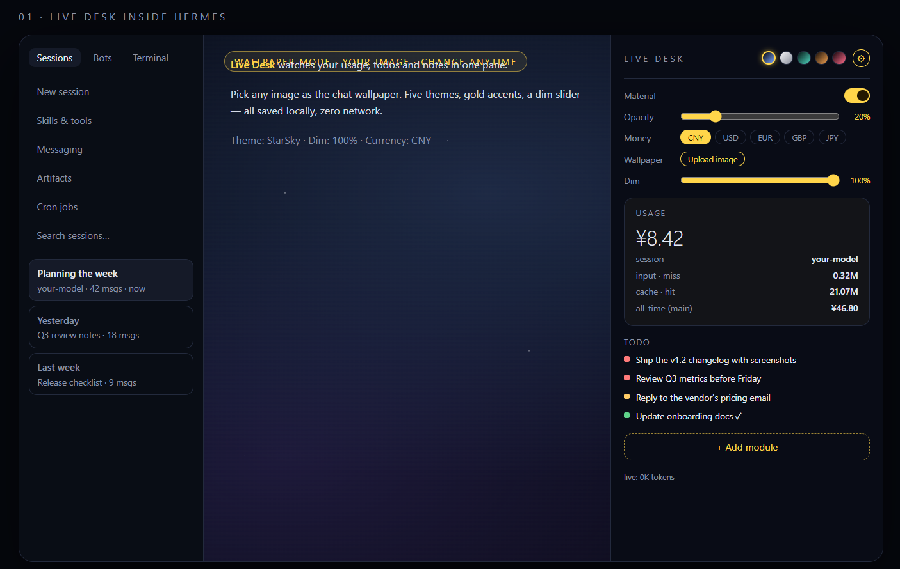
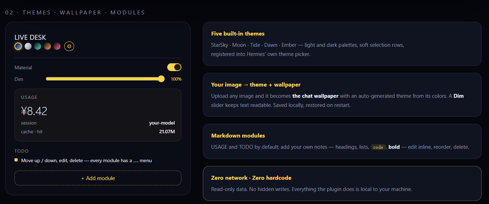

# Hermes-Living-Desktop

A living desktop companion for Hermes Agent — a right-side **Live Desk** pane that puts your usage, todos and notes in one glanceable surface, with five built-in themes, image-to-theme generation and a chat wallpaper.




## Features

**Live Desk pane**
- Usage card — session cost, input (miss), cache (hit), all-time by model
- Todo list — your own todo file, color-coded, live-refreshed
- Markdown note modules — headings, lists, bold, code; add / move / edit / delete via each module's `⋯` menu

**Five built-in themes**
StarSky · Moon · Tide · Dawn · Ember — each ships light + dark palettes and registers into Hermes' own theme picker. Soft selection rows, brand color kept in buttons and focus rings.

**Image → theme + wallpaper**
Upload an image and it becomes the chat wallpaper, with a theme auto-generated from its colors. A **Dim** slider (0–100%) keeps text readable at any brightness — a dim layer adapts to the image automatically, and you can override it live. Change the background anytime the same way.

**Currency display**
CNY / USD / EUR / GBP / JPY. FX rates are reference only — the maker assumes no liability.

**Persistence**
Every choice (theme, dim, currency, modules, wallpaper) is saved locally and restored on restart.

## Install

1. Copy this repo's folder to `~/.hermes/plugins/hermes-living-desktop/`
   (on Windows: `%LOCALAPPDATA%\hermes\plugins\hermes-living-desktop\`)
2. Restart Hermes Desktop
3. **Capabilities → Plugins → Disk** (技能与工具 → 插件) — enable `hermes-living-desktop`
4. The **Live Desk** pane appears on the right side

If the pane doesn't appear: `Ctrl+K → Reload desktop plugins`, then check the plugin toggle again.

## Security

- **Zero network** — nothing phones home, no telemetry, no external requests
- **Zero hardcode** — no baked-in paths, credentials or machine-specific values
- **Read-only data** — the backend only reads `state.db` and your todo file
- **The only write** is your own explicit image upload (png / jpg / webp, ≤ 50 MB), saved inside the plugin folder
- **Link whitelist** for markdown notes ships in 2.0 (external links are currently rendered as-is)

## What we learned the hard way

1. `file://` images are blocked by browser security when the renderer runs over `http://127.0.0.1` — serve through local HTTP or embed data URLs.
2. CSS `url()` requests cannot carry auth headers, so Hermes API routes return 401 — data URLs sidestep this entirely.
3. The `body` background is fully covered by the app shell — target the chat surface element directly.
4. Inline styles get overwritten by React re-renders — a dedicated `<style>` tag with `!important` rules survives them.
5. A theme must ship both light and dark palettes; a single palette breaks light-mode contrast.
6. In Hermes themes, `accent` is the soft selection-row color — brand color belongs in `primary` / `ring` / `midground`.
7. The backend's auth token lives in a request header, not a cookie — native `fetch` gets 401; use the plugin SDK's `ctx.rest` / `upload` channel instead.

## Structure

```
plugins/hermes-living-desktop/
├── dashboard/
│   ├── manifest.json      # { "name": "hermes-living-desktop", "api": "plugin_api.py" }
│   ├── plugin_api.py      # GET /usage · GET /todo · POST /upload · GET /wallpaper
│   └── todo_path.txt      # points at your todo markdown (edit to taste)
└── desktop/
    └── plugin.js          # the pane, themes, wallpaper layer, modules
```

## Requirements

- Hermes Agent with desktop plugin support (Capabilities → Plugins)
- Nothing else — the plugin uses only the standard plugin SDK

## Disclaimers

1. **I'm new to this.** The author is a beginner at GitHub and at building AI-agent code — feedback, learning exchanges and friendly corrections are all welcome. Leave a note in the **Issues** tab and I'll reply when I can. (GitHub has no private "mailbox" for strangers — Issues is the public, reliable channel.)
2. **This is a demo build.** It exists to prove the idea. If there's a feature you'd like to see, open an issue — I'll weigh it against the cost of building it.
3. **Read before you run.** Let your own Hermes Agent read through the plugin files first, so you can confirm what it does and that it matches your Hermes version. Built and tested on Hermes Desktop **v0.21.5**.
4. **More experiments coming.** I plan to publish more agent- and skill-related experiments over time.

## Roadmap

- 2.0 — link whitelist for notes, file-picker UX, video wallpaper (external engine), HUD mode

## License

MIT — do what you want; the wallpaper slot is yours to fill.
